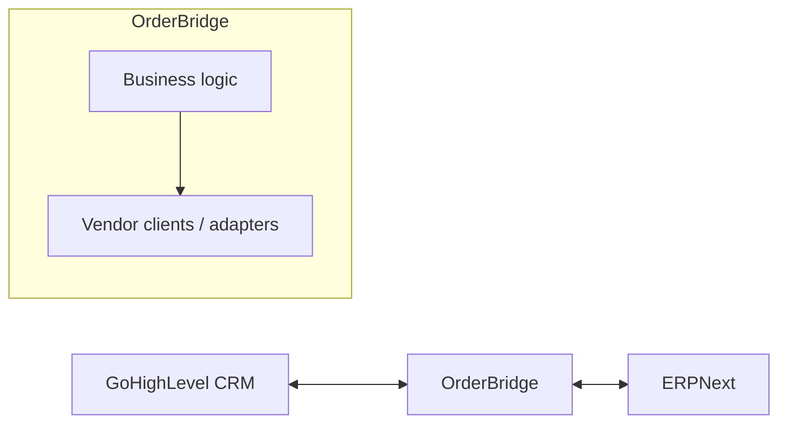

# OrderBridge

[](https://github.com/hamzaafzal391/orderbridge/actions/workflows/ci.yml)

A reliable CRM-to-ERP integration layer: **GoHighLevel (CRM) ↔ OrderBridge ↔ ERPNext (ERP)**.

> **Status: early development.** One piece is built and tested (the ERPNext customer client).
> The rest is planned; see [Status](#status).

## The problem

Sales teams work in a CRM, while finance and fulfilment work in an ERP. Copying orders and
customers between them by hand is slow and error-prone. Naive integrations also fail quietly:
a timeout creates a duplicate order, a bad response corrupts data, an expired API key goes
unnoticed.

OrderBridge sits between the two systems and treats reliability as the main feature:
validation, error classification, idempotency, retries and audit history.

## Architecture



Business logic never talks to a vendor API directly. Vendor-specific code lives in
`app/clients/`, so either system can later be replaced by writing a new adapter.

## Status

| Area | State |
|---|---|
| ERPNext customer client (typed models, classified errors, injectable HTTP client) | Done |
| Unit tests with a fake HTTP transport (no live services) and CI on every PR | Done |
| Internal customer model, independent of any vendor | Planned |
| GoHighLevel client | Planned |
| Idempotency, retries with backoff, duplicate-event handling | Planned |
| API (FastAPI), PostgreSQL storage, structured logs, replay and reconciliation | Planned |
| Docker and AWS deployment | Planned |

## Reliability design

- **Errors are classified at the client boundary.** Callers see `ERPNextAuthenticationError`,
  `ERPNextNotFoundError`, `ERPNextRateLimitError`, `ERPNextTemporaryError`,
  `ERPNextResponseError` or `ERPNextAPIError`, never raw HTTP library exceptions. A future retry
  layer can then tell retryable failures (429, 5xx, timeouts) from permanent ones.
- **Responses are validated.** ERPNext replies are parsed into Pydantic models; malformed
  data becomes a clear error instead of a crash later.
- **Every outbound call has an explicit timeout.**
- **No secrets or customer data in errors or logs.** Error messages contain status codes and
  field names, never response bodies, credentials or values.
- **Tests never touch live services.** HTTP is faked with `httpx.MockTransport`.

Design decisions are recorded in [`docs/adr/`](docs/adr/).

## Quickstart

Requires Python 3.14.

```bash
git clone https://github.com/hamzaafzal391/orderbridge.git
cd orderbridge
python3.14 -m venv .venv && source .venv/bin/activate
pip install -e ".[dev]"

pytest -q
ruff check . && ruff format --check .
```

To use the ERPNext client against a real instance, copy `.env.example` to `.env` and fill in
`ERPNEXT_BASE_URL`, `ERPNEXT_API_KEY` and `ERPNEXT_API_SECRET`. `.env` is git-ignored.

```python
from app.clients.erpnext import ERPNextClient
from app.clients.erpnext_errors import ERPNextNotFoundError

with ERPNextClient() as client:
    try:
        customer = client.get_customer("NorthStar Mechanical LLC")
        print(customer.name, customer.credit_limits)
    except ERPNextNotFoundError:
        print("No such customer")
```

## Project layout

```
app/
├── config.py               # settings loaded from environment / .env
└── clients/
    ├── erpnext.py          # ERPNext HTTP client
    ├── erpnext_errors.py   # error hierarchy
    └── erpnext_models.py   # typed response models
tests/unit/                 # fast tests, no network
docs/adr/                   # architecture decision records
.github/workflows/ci.yml    # lint, format check and tests on every PR
```

## Workflow

Small feature branches, [Conventional Commits](https://www.conventionalcommits.org/), and
squash-merged pull requests into a protected `main` that requires passing CI.
Project rules for contributors and AI assistants are in [`CLAUDE.md`](CLAUDE.md).
